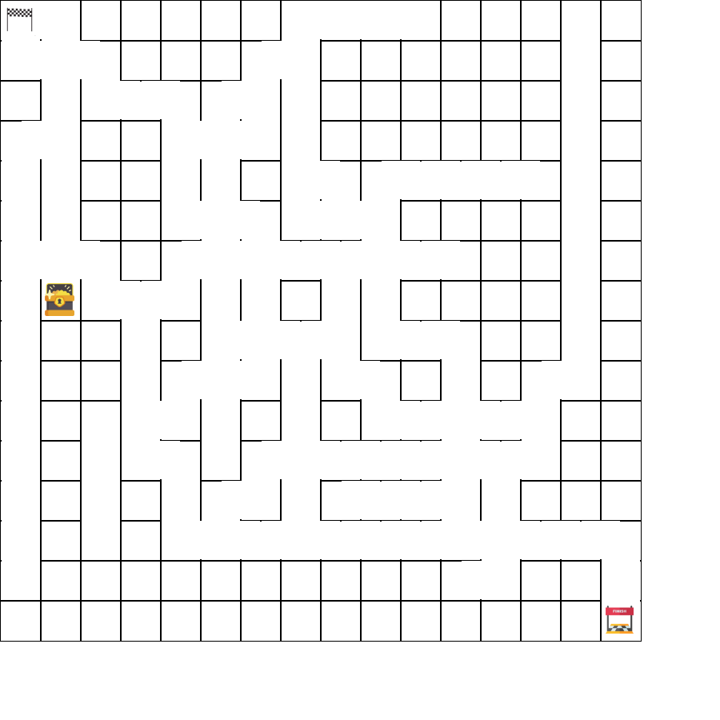

This project is a technical test.

The goal was to create a python program using flask that can create a maze with the data provided by the user :

- a `start` point
- a `treasure` point
- an `exit` point
- a path must exist from start point to treasure point
- a path must exist from start point to exit point
- the size of the maze is determined by the exit position (if exit(4,4) => size = 5, if exit(12,12) => size = 13)
- a "size number" of random path is generated to create fake ways

Step to reproduce to set up the server:

1. clone this repo

`git clone git@github.com:fturhan/maze.git`

2. create a virtualenv

`python -m venv venv`

3. activate the virtualenv

`source venv/bin/activate` (sur linux)

4. install requirements

`pip install -r requirements.txt`

5. lancer le serveur

`python -m flask --app maze_game run --debug`

When the server is ready, use postman (or equivalent) to make a post request to the server at http://127.0.0.1:5000/?start=(0,0)&treasure=(1,7)&exit(15,15)

